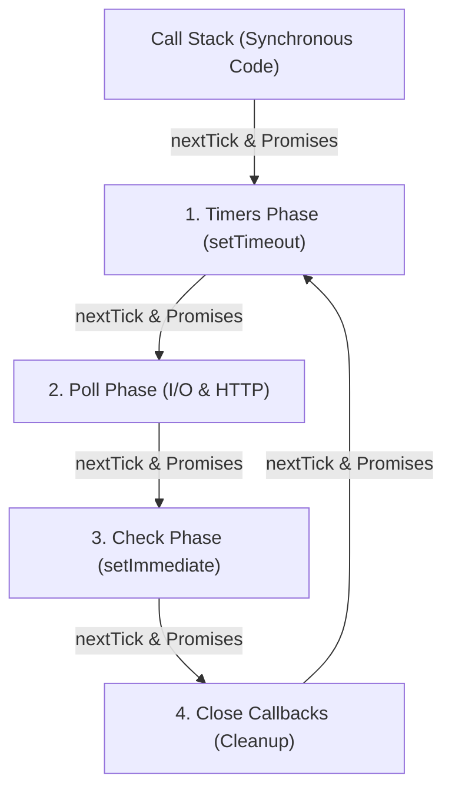

# Day 02: Event Loop and Scheduling

<nav aria-label="Lecture navigation">

[← Previous: Node.js Runtime and Architecture](day-01-node-runtime-and-architecture.md) | [Roadmap](../node-roadmap.md) | [Next: Modules, Packages, and Resolution →](day-03-modules-packages-and-resolution.md)

</nav>

---

## What You Will Learn Today

By the end of this lecture, you should be able to:

- Explain what the libuv event loop is and how it coordinates asynchronous non-blocking I/O on a single JavaScript thread.
- Detail the exact responsibilities, order, and triggers of the six libuv loop phases: Timers, Pending Callbacks, Idle/Prepare, Poll, Check, and Close Callbacks.
- Trace the lifecycle of an asynchronous operation from JavaScript invocation through OS/thread pool delegation to callback dispatch.
- Differentiate between the two microtask queues (`process.nextTick` and ECMAScript Promise jobs) and predict when microtask checkpoints drain.
- Explain why the execution order between `setTimeout(fn, 0)` and `setImmediate(fn)` is non-deterministic at the top level but strictly deterministic inside an I/O callback.
- Understand the Node.js 20+ libuv timer refactor and how it affects loop iteration checkpoints.
- Identify and prevent event loop starvation caused by long synchronous loops and recursive microtask queues.
- Partition CPU-intensive work across event loop iterations using cooperative chunking with `setImmediate()`.
- Measure production event loop lag using the built-in `node:perf_hooks` module.

**Prerequisites:** [Day 01: Node.js Runtime and Architecture](day-01-node-runtime-and-architecture.md) and [JavaScript Day 20: Jobs, Microtasks, and Scheduling](../../Javascript/javascript-lectures/day-20-jobs-microtasks-and-scheduling.md).  
*Upcoming Connections:* [Day 03: Modules, Packages, and Resolution](day-03-modules-packages-and-resolution.md) explores how module loading evaluates synchronously; [Day 08: Streams and Backpressure](day-08-streams-and-backpressure.md) demonstrates non-blocking chunk streaming through the Poll phase; [Day 11: Worker Threads and Child Processes](day-11-worker-threads-and-child-processes.md) shows true parallelism for CPU workloads that cannot be safely partitioned.

---

## Quick Vocabulary Card

| Term | Definition |
| :--- | :--- |
| **Event Loop** | A semi-infinite loop managed by libuv that monitors OS notification channels and dispatches queued callbacks to the JavaScript call stack. |
| **Call Stack** | The V8 execution stack where synchronous JavaScript functions and active callbacks run to completion (Run-to-Completion model). |
| **Microtask Checkpoint** | A synchronization point occurring immediately after the call stack empties or after an individual callback finishes, where `nextTick` and Promise queues are completely drained. |
| **`process.nextTick` Queue** | A Node.js-internal queue executed before any other microtasks or event loop phases; draining it takes precedence over Promise jobs. |
| **Promise Microtask Queue** | The ECMAScript standard job queue that executes `.then()`, `.catch()`, `.finally()`, and resumed `async/await` continuations. |
| **Timers Phase** | The libuv loop phase that executes callbacks for expired `setTimeout()` and `setInterval()` timers. |
| **Poll Phase** | The core phase of libuv that retrieves new I/O events from the OS kernel, runs ready I/O callbacks, and blocks to wait if no other work is pending. |
| **Check Phase** | The libuv phase dedicated exclusively to executing callbacks scheduled via `setImmediate()`, running directly after Poll. |
| **Close Callbacks Phase** | The libuv phase that handles resource cleanup events, such as `socket.on('close', ...)`. |
| **Event Loop Starvation** | A condition where synchronous operations or recursive microtask queues monopolize the JavaScript thread, preventing the loop from advancing to I/O or timers. |
| **Event Loop Lag** | The delay between when an asynchronous callback was scheduled to run and when it actually gets executed on the main thread. |

---

## 1. What is the Event Loop?

**The event loop is a continuous control loop provided by libuv that collects events from the operating system and dispatches their associated JavaScript callbacks to V8's call stack.**

JavaScript itself has no built-in concept of time, network sockets, or filesystem handles. V8 simply executes code sequentially until its call stack is completely empty. The host platform (Node.js via libuv) surrounds V8 with an event loop that feeds callbacks back onto the call stack whenever external events—such as completed disk reads, incoming TCP connections, or expired timers—are ready.

**Single-Threaded JavaScript vs. Multi-Threaded Node.js:**  
While your JavaScript code runs on a single main thread, Node.js itself is multi-threaded behind the scenes. Node delegates heavy tasks (like file I/O, DNS lookups, and crypto) to libuv's background thread pool, and hands network sockets directly to the operating system kernel, returning to the single JavaScript thread only when callbacks are ready to execute.

### Real-World Analogy: The Clinic and the Dispatch Clerk
Imagine a medical clinic with a single doctor (**V8's JavaScript Call Stack**) and an organized dispatch clerk (**libuv's Event Loop**):
- The doctor can examine only one patient at a time and never stops midway through an examination (**Run-to-Completion**).
- When a patient needs a blood test (**Asynchronous I/O**), the doctor does not sit waiting for lab results. The patient is sent to an external laboratory (**OS Kernel / libuv Thread Pool**), and the doctor immediately calls the next patient.
- When the lab results arrive, the clerk files them into specialized colored inboxes (**Loop Phases**).
- Between each patient, the doctor immediately handles urgent sticky notes left on the desk (**Microtasks: `nextTick` and Promises**).
- Only when all urgent notes are cleared does the clerk guide the doctor to the next scheduled colored inbox in order.



> **Key Rule:** Microtasks (`process.nextTick` and Promises) are **not** an event loop phase. Instead, Node runs a **Microtask Checkpoint** to drain all pending microtasks immediately after synchronous code finishes, between every single phase, and after every individual callback.

```js
// Node.js code
// Demonstrating Run-to-Completion and Microtasks draining between phases

console.log("1. Synchronous main thread start");

// Scheduled for Phase 1: Timers Phase
setTimeout(() => {
  console.log("4. Timer callback fired (Timers Phase)");

  // Scheduled inside Timers callback: Drains immediately before moving to the next phase!
  process.nextTick(() => console.log("   -> nextTick inside Timer (drains before next phase!)"));
  Promise.resolve().then(() => console.log("   -> Promise inside Timer (drains before next phase!)"));
}, 0);

// Scheduled for Phase 5: Check Phase
setImmediate(() => {
  console.log("5. Immediate callback fired (Check Phase)");

  // Scheduled inside Check callback: Drains immediately after this callback finishes
  process.nextTick(() => console.log("   -> nextTick inside Immediate (drains immediately)"));
});

// Scheduled at top-level: Drained immediately after synchronous code finishes
process.nextTick(() => {
  console.log("2. Top-level nextTick microtask");
  // Scheduled inside microtask: Enters Timers phase on a subsequent loop cycle!
  setTimeout(() => console.log("   -> Timer scheduled from nextTick (runs in Timers phase)"), 0);
});

Promise.resolve().then(() => {
  console.log("3. Top-level Promise microtask");
  // Scheduled inside microtask: Enters Check phase on the loop cycle!
  setImmediate(() => console.log("   -> Immediate scheduled from Promise (runs in Check phase)"));
});

// ❌ Anti-pattern: Blocking the main thread delays EVERYTHING behind it
// const end = Date.now() + 2000;
// while (Date.now() < end) {} // Freezes all callbacks for 2 seconds

// ✅ Valid: Synchronous code finishes first, leaving the stack clean
console.log("6. Synchronous main thread end");

// Output:
// 1. Synchronous main thread start
// 6. Synchronous main thread end
// 2. Top-level nextTick microtask
// 3. Top-level Promise microtask
// 4. Timer callback fired (Timers Phase)
//    -> nextTick inside Timer (drains before next phase!)
//    -> Promise inside Timer (drains before next phase!)
// 5. Immediate callback fired (Check Phase)
//    -> nextTick inside Immediate (drains immediately)
//    -> Immediate scheduled from Promise (runs in Check phase)
//    -> Timer scheduled from nextTick (runs in Timers phase)
```

---

## 2. The Six Phases of the libuv Event Loop

When libuv runs an iteration of the event loop, it moves through distinct phases in a rigid order. Each phase maintains a FIFO (First-In, First-Out) queue of callbacks.

### 2.1 Timers Phase
- **What it does:** Executes callbacks whose scheduled threshold has passed for `setTimeout()` and `setInterval()`.
- **Key behavior:** Timers specify a *minimum threshold* before a callback may run—not an exact execution time. Libuv checks the current loop time against a min-heap of active timers. If the timer has expired, its callback runs; otherwise, the loop moves forward.
- **Node delay clamp:** Passing `0` or negative values (e.g., `setTimeout(fn, 0)`) is automatically normalized by Node.js to `1ms` (`setTimeout(fn, 1)`).

### 2.2 Pending Callbacks Phase
- **What it does:** Executes deferred system-level callbacks from the previous loop iteration.
- **Key behavior:** If an operating system operation reported an error (for example, a TCP socket received an `ECONNREFUSED` error during a connect call on Linux), some systems wait to report the error. Those callbacks are queued here rather than in the Poll phase.

### 2.3 Idle & Prepare Phase
- **What it does:** Internal bookkeeping used only by libuv to prepare state before polling for new I/O.
- **Key behavior:** Node.js application code cannot directly queue callbacks into this phase.

### 2.4 Poll Phase
- **What it does:** The primary engine of Node.js. It calculates how long it should wait (block) for new OS I/O events, and processes all ready network, file, and pipe callbacks.
- **OS & libuv Boundary for HTTP / Network I/O:** HTTP and network operations do **not** run or block inside the event loop itself. Instead, the operating system kernel handles TCP network sockets in the background via non-blocking notification systems (`epoll` on Linux, `kqueue` on macOS, `IOCP` on Windows). When network packets arrive, the OS kernel alerts libuv, and libuv wakes up the **Poll Phase** to push the associated JavaScript callback onto the Call Stack.
- **Decision logic when entering Poll:**
  1. If callbacks are queued in the Poll queue, it runs them sequentially up to a system-defined limit.
  2. If the Poll queue is empty:
     - If callbacks are waiting in the **Check Phase** (`setImmediate`), Poll ends immediately and the loop advances to Check.
     - If timers are ready in the **Timers Phase**, Poll ends immediately and wraps around to Timers.
     - If neither condition is met, **libuv blocks the thread and sleeps**, waiting for OS kernel events (network packets, file completions) until either an event arrives or the closest timer deadline expires.

```text
               +--------------------------------------+
               |          Enter Poll Phase            |
               +--------------------------------------+
                                  |
                                  v
                   /------------------------------\
                  <  Are I/O callbacks queued?     >
                   \------------------------------/
                             /          \
                     Yes    /            \   No
                           v              v
            +---------------------+   /------------------------------\
            | Run I/O callbacks   |  <   Is setImmediate queued?      >
            | (up to system limit)|   \------------------------------/
            +---------------------+          /              \
                                     Yes    /                \   No
                                           v                  v
                             +--------------------+   /------------------------------\
                             | Leave Poll; go to  |  <   Are expired timers waiting?  >
                             | Check phase        |   \------------------------------/
                             +--------------------+          /              \
                                                     Yes    /                \   No
                                                           v                  v
                                             +--------------------+   +--------------------+
                                             | Leave Poll; wrap   |   | Sleep & block OS   |
                                             | around to Timers   |   | until I/O or timer |
                                             +--------------------+   +--------------------+
```

### 2.5 Check Phase
- **What it does:** Executes callbacks scheduled via `setImmediate()`.
- **Key behavior:** Designed specifically to run code *immediately after the Poll phase completes*. If the Poll phase finishes handling an I/O event and an immediate was registered, Node transitions directly to Check without waiting for any timer expiration.

### 2.6 Close Callbacks Phase
- **What it does:** Executes teardown callbacks when handles are abruptly closed.
- **Key behavior:** For example, when a TCP connection is closed via `socket.destroy()`, the `'close'` event callback (`socket.on('close', fn)`) runs here. This separates normal operational logic from resource deallocation.

### Summary Comparison Table of Event Loop Phases

| Phase | Handled Operations | Primary APIs | When Does It Exit? |
| :--- | :--- | :--- | :--- |
| **1. Timers** | Expired timer thresholds | `setTimeout()`, `setInterval()` | When all expired timers have run or max threshold reached |
| **2. Pending** | Deferred OS-level system errors | Internal TCP/UDP error handlers | When pending error queue drains |
| **3. Idle/Prepare** | libuv internal sync | None (internal only) | Immediately after internal update |
| **4. Poll** | Incoming connections, data, disk I/O | `net.Server`, `fs.readFile`, incoming HTTP | When queue is empty or if `setImmediate`/timers are waiting |
| **5. Check** | Post-I/O callbacks | `setImmediate()` | When all immediate callbacks have executed |
| **6. Close** | Resource destruction & cleanup | `socket.on('close')`, `stream.on('close')` | When all close listeners finish |

---

## 3. Microtask Queues: `process.nextTick` vs. Promise Microtasks

Microtasks are not part of libuv's 6-phase event loop. They are managed directly by Node.js and the V8 engine as higher-priority interim queues that drain at **microtask checkpoints**.

### 3.1 Two Separate Microtask Queues
1. **The `nextTick` Queue:** Populated by `process.nextTick()`. This is a Node-specific construct.
2. **The Promise Microtask Queue:** Populated by native ECMAScript Promise reactions (`.then()`, `.catch()`, `.finally()`, and `await` resumes) and `queueMicrotask()`.

### 3.2 Strict Draining Order
Whenever V8 finishes executing a JavaScript callback and the call stack unwinds to zero, Node initiates a microtask checkpoint:
1. Node drains the **entire** `process.nextTick` queue until it is completely empty.
2. Node drains the **entire** Promise microtask queue until it is completely empty.
3. If a `nextTick` callback schedules *another* `nextTick`, the new callback is drained in the current checkpoint before any Promise or event loop phase can run.

### 3.3 Modern Checkpoint Frequency (Node.js 11+)
In legacy Node.js (v10 and earlier), microtasks were only drained between phase transitions. Since **Node.js 11+**, Node aligns with the HTML5 web standard: **microtasks are drained immediately after every single callback execution**, even between two individual timers or two individual immediates.

```js
// Node.js code
// Demonstrating microtask checkpoint order and interleaving

console.log("Start");

// Schedule a timer in the event loop
setTimeout(() => {
  console.log("Timer 1");
  // Scheduled inside Timer 1 - will run before Timer 2!
  process.nextTick(() => console.log("nextTick inside Timer 1"));
}, 0);

setTimeout(() => {
  console.log("Timer 2");
}, 0);

// Scheduled at top-level
Promise.resolve().then(() => console.log("Top-level Promise"));
process.nextTick(() => console.log("Top-level nextTick"));

console.log("End");

// Output:
// Start
// End
// Top-level nextTick          (nextTick drains before Promise)
// Top-level Promise           (Promise drains before loop phases)
// Timer 1                     (Timers phase entered)
// nextTick inside Timer 1     (Drained IMMEDIATELY after Timer 1 callback!)
// Timer 2                     (Then next timer runs)
```

---

## 4. `setTimeout(fn, 0)` vs. `setImmediate(fn)`

The execution order of `setTimeout(fn, 0)` and `setImmediate(fn)` is one of the most frequent interview questions in Node.js. The answer depends entirely on **where** the code is invoked.

### Scenario A: Invoked from Top-Level (Main Script)
**The order is non-deterministic (cannot be guaranteed).**

Why?
1. When Node compiles and runs the top-level script, it registers a timer with a 0ms delay. Internally, Node clamps `0` to `1ms`.
2. Node also registers an immediate in the Check phase.
3. Node then enters the libuv event loop. Entering the loop requires a non-zero amount of CPU time (process setup, AST parsing, OS clock resolution).
4. If the loop enters the Timers phase before 1ms of wall-clock time has passed, the timer is not yet expired. The loop skips Timers, passes through Poll, and executes `setImmediate` in the Check phase first.
5. If the machine is under CPU load or the clock ticks past 1ms before the loop starts, the timer is seen as expired, and `setTimeout` runs first.

### Scenario B: Invoked Inside an I/O Callback
**`setImmediate()` is 100% GUARANTEED to execute before `setTimeout(fn, 0)`.**

Why?
1. An active I/O callback executes inside the **Poll Phase**.
2. Inside that callback, you schedule both `setImmediate()` and `setTimeout(fn, 0)`.
3. When the I/O callback finishes, the event loop must advance.
4. Looking at the phase order: **Check Phase immediately follows Poll Phase**, whereas Timers Phase is only reached on the *next* iteration of the loop!
5. Therefore, `setImmediate()` always runs first in any I/O cycle.

### Node.js 20+ Libuv Timer Refactor
In Node.js 20, libuv refactored how timer deadlines are calculated relative to the poll timeout. Timers are processed after the Poll phase during the loop iteration rather than both before and after poll. While this improved internal timer consistency, top-level non-determinism remains unchanged due to initial process startup clock jitter.

```js
// Node.js code
// Demonstrating top-level non-determinism vs I/O determinism

const fs = require("node:fs");

// Case 1: Top-level invocation (Non-deterministic)
// ❌ Do not rely on this ordering in production!
setTimeout(() => console.log("Top-level: setTimeout(0)"), 0);
setImmediate(() => console.log("Top-level: setImmediate"));

// Case 2: Inside an I/O cycle (Strictly Deterministic)
// ✅ Always guaranteed: setImmediate runs BEFORE setTimeout(0)
fs.readFile(__filename, () => {
  console.log("\n--- Inside I/O Cycle ---");
  
  setTimeout(() => {
    console.log("I/O: setTimeout(0) [Runs on next loop cycle]");
  }, 0);

  setImmediate(() => {
    console.log("I/O: setImmediate [Runs immediately in current Check phase]");
  });
});
```

---

## 5. Lifecycle of an Asynchronous Operation

To understand how Node scales, you must be able to trace an asynchronous request from the moment JavaScript calls it to the moment its callback executes.

```text
[1. JS Invocation]      fs.readFile('data.txt', callback)
                              |
[2. Node Core Binding]  Validates arguments; translates JS callback to native C++ handle
                              |
[3. Libuv Delegation]   Submits filesystem request to libuv Thread Pool
                              |
[4. Main Thread Frees]  Call stack unwinds; JavaScript continues running synchronously
                              |
                        [...Time passes: libuv thread reads disk in background...]
                              |
[5. I/O Completion]     Thread finishes; notifies libuv main loop via OS pipe
                              |
[6. Poll Phase]         Event loop wakes; Poll phase retrieves completion packet
                              |
[7. JS Callback Push]   libuv pushes callback to V8 Call Stack
                              |
[8. Microtask Drain]    Callback finishes; nextTick & Promise queues drain immediately
```

### Complete Event-Loop Trace: A Comprehensive Walkthrough
Follow this complete execution trace carefully. Every label represents an observable stage:

```js
// Node.js code
// Comprehensive Scheduling Trace

const fs = require("node:fs");

console.log("A: Synchronous start");

setTimeout(() => {
  console.log("D: Top-level timer callback");
}, 0);

setImmediate(() => {
  console.log("E: Top-level immediate callback");
});

fs.readFile(__filename, () => {
  console.log("F: I/O callback executed");
  process.nextTick(() => console.log("G: nextTick from I/O"));
  Promise.resolve().then(() => console.log("H: Promise from I/O"));
  setImmediate(() => console.log("I: setImmediate from I/O"));
  setTimeout(() => console.log("J: setTimeout(0) from I/O"), 0);
});

Promise.resolve().then(() => console.log("C: Top-level promise"));
process.nextTick(() => console.log("B: Top-level nextTick"));

console.log("K: Synchronous end");
```

### Trace Step-by-Step Breakdown:
1. **Synchronous Execution:**
   - Prints `A: Synchronous start`.
   - `setTimeout` registers in Timers min-heap.
   - `setImmediate` registers in Check queue.
   - `fs.readFile` dispatches to libuv thread pool.
   - `Promise.resolve().then` registers in Promise microtask queue.
   - `process.nextTick` registers in `nextTick` queue.
   - Prints `K: Synchronous end`.
2. **First Microtask Checkpoint:**
   - Stack is empty. `nextTick` queue drains: Prints `B: Top-level nextTick`.
   - Promise queue drains: Prints `C: Top-level promise`.
3. **Event Loop Begins:**
   - Executes `D` and `E` (order between `D` and `E` may flip depending on startup clock latency).
4. **Poll Phase (I/O Ready):**
   - The thread pool completes reading `__filename`. Poll phase picks up the event and executes `F: I/O callback executed`.
5. **Microtask Checkpoint Inside I/O:**
   - Immediately after `F` finishes, microtasks drain:
   - Prints `G: nextTick from I/O`.
   - Prints `H: Promise from I/O`.
6. **Check Phase Follows Poll:**
   - The loop leaves Poll and transitions directly to Check.
   - Prints `I: setImmediate from I/O`.
7. **Next Loop Iteration (Timers):**
   - The loop wraps around to Timers on the subsequent iteration.
   - Prints `J: setTimeout(0) from I/O`.

---

## 6. Event Loop Starvation and Work Partitioning

Because JavaScript executes on a single main thread, long synchronous operations or endless microtask queues cause **Event Loop Starvation**: the event loop cannot advance, meaning network requests time out, health checks fail, and timers never fire.

### 6.1 Starvation via Recursive `process.nextTick`
Because Node drains the `nextTick` queue recursively before any event loop phase, an unchecked `nextTick` recursion completely freezes the server:

```js
// Node.js code
// Starvation Demonstration: Unbounded microtasks freeze the event loop

let count = 0;

function starveEventLoop() {
  count++;
  if (count < 1000000) {
    // ❌ Danger: nextTick re-queues itself before the loop can ever progress!
    process.nextTick(starveEventLoop);
  }
}

// Register a timer that should fire in 10ms
setTimeout(() => {
  console.log("✅ Timer finally ran after starvation cleared");
}, 10);

console.log("Starting starvation test...");
starveEventLoop();
// The timer will not fire for hundreds of milliseconds until 1,000,000 nextTicks finish!
```

### 6.2 Work Partitioning with `setImmediate`
When you have a massive CPU computation (e.g., parsing a 50,000-row array) that cannot be moved to a Worker Thread immediately, you must **partition** the work cooperatively across multiple event loop turns using `setImmediate()`.

By yielding back to the Check phase after processing a small batch, you allow the Poll phase to handle incoming HTTP requests and let Timers fire between chunks.

```js
// Node.js code
// ✅ Cooperative Partitioning: Processing large workloads without blocking I/O

function processLargeDatasetCooperatively(items, batchSize, onProgress, onComplete) {
  let currentIndex = 0;

  function processNextBatch() {
    const end = Math.min(currentIndex + batchSize, items.length);

    // Process a small, bounded slice synchronously
    while (currentIndex < end) {
      // Simulate computational work
      const item = items[currentIndex];
      item.processed = true;
      currentIndex++;
    }

    onProgress(currentIndex, items.length);

    if (currentIndex < items.length) {
      // ✅ Yield to the event loop!
      // This allows incoming HTTP requests, I/O, and timers to run before the next chunk.
      setImmediate(processNextBatch);
    } else {
      onComplete();
    }
  }

  // Kick off the first batch
  setImmediate(processNextBatch);
}

// Usage:
const largeList = Array.from({ length: 10000 }, (_, i) => ({ id: i }));

processLargeDatasetCooperatively(
  largeList,
  1000, // Process 1,000 items per event loop turn
  (current, total) => console.log(`Progress: ${current} / ${total}`),
  () => console.log("✅ All items processed cooperatively without freezing the loop!")
);
```

---

## 7. Monitoring Event Loop Delay in Production

You cannot optimize what you do not measure. In production services, high CPU usage does not always mean high response latency—and conversely, low CPU usage can hide massive event loop latency if the thread is frequently blocked for 50ms at a time.

Node.js provides a native, low-overhead histogram utility in the `node:perf_hooks` module called `monitorEventLoopDelay`.

### Event Loop Delay (Lag)
Event loop delay measures the time delta between when a timer was scheduled to run and when it actually executed. If a 20ms timer takes 70ms to run, your event loop lag is **50ms**.

```js
// Node.js code
// Production Event Loop Lag Monitoring via node:perf_hooks

const { monitorEventLoopDelay } = require("node:perf_hooks");

// Initialize the delay monitor with a 20ms sampling resolution
const histogram = monitorEventLoopDelay({ resolution: 20 });

// Enable monitoring
histogram.enable();

// Periodically inspect metrics (e.g., every 5 seconds for Prometheus/Datadog)
setInterval(() => {
  // Convert nanoseconds to milliseconds
  const minMs = (histogram.min / 1e6).toFixed(2);
  const maxMs = (histogram.max / 1e6).toFixed(2);
  const meanMs = (histogram.mean / 1e6).toFixed(2);
  const p99Ms = (histogram.percentile(99) / 1e6).toFixed(2);

  console.log(`[Event Loop Lag] Min: ${minMs}ms | Mean: ${meanMs}ms | p99: ${p99Ms}ms | Max: ${maxMs}ms`);

  // Reset the histogram for the next interval window
  histogram.reset();
}, 2000);

// Simulate a sudden blocking CPU spike to observe latency recording
setTimeout(() => {
  console.log("Simulating 150ms synchronous CPU block...");
  const blockUntil = Date.now() + 150;
  while (Date.now() < blockUntil) {} // ❌ Synchronous freeze
}, 1000);
```

---

## 8. JavaScript, Node.js, and DSA Connections

Understanding the event loop requires connecting language semantics, runtime engineering, and data structure design.

- **JavaScript Language Connection:** ECMAScript specifies the Call Stack and Promise Jobs (Microtasks). The ECMAScript specification has no awareness of files, sockets, or timers. It only requires that job queues drain when the execution context stack is empty.
- **Node.js Platform Connection:** Node.js implements the host environment. Libuv provides the 6-phase scheduling loop that bridges OS asynchronous notification systems (`epoll` on Linux, `kqueue` on macOS, `IOCP` on Windows) to V8 callbacks.
- **DSA Connection:**
  - **Min-Heap for Timers:** Libuv manages active timers in a binary min-heap where the root element is always the timer with the nearest expiration timestamp ($O(1)$ lookup, $O(\log n)$ insertion/deletion).
  - **FIFO Queues:** Microtasks, Check (`setImmediate`), and Close callbacks are organized as linked FIFO queues ($O(1)$ enqueue and dequeue).
  - **Queue Starvation & Latency:** If an upstream FIFO queue is replenished faster than its items can be processed ($R_{\text{in}} > R_{\text{out}}$), queue length diverges to infinity, consuming memory and starving downstream queues.

---

## Tricky Points & Common Pitfalls

### 1. `setTimeout(fn, 0)` is Never 0 Milliseconds
Node.js clamps delay values `0`, negative numbers, and non-numbers (`NaN`) to `1`. Furthermore, even if 1ms elapses, the callback cannot run until the current call stack finishes, all microtasks drain, and the loop reaches the Timers phase.

### 2. `await` Does NOT Make Synchronous Code Asynchronous
Marking a function `async` does not magically run its contents in the background. Everything up to the first `await` keyword runs **100% synchronously**. Furthermore, any synchronous computation passed inside `await Promise.resolve(heavyComputation())` executes synchronously *before* the promise is resolved!

### 3. `EventEmitter.emit()` is Completely Synchronous
Many developers mistakenly believe that events run on the event loop. In reality, `emitter.emit('event')` executes all registered listener callbacks synchronously one after another on the current call stack.

```js
// Node.js code
// Demonstrating EventEmitter synchronous execution

const EventEmitter = require("node:events");
const emitter = new EventEmitter();

emitter.on("data", () => {
  console.log("2. Listener 1 (Synchronous)");
});

emitter.on("data", () => {
  console.log("3. Listener 2 (Synchronous)");
});

console.log("1. Before emit");
emitter.emit("data"); // ❌ Not scheduled on event loop! Executes immediately.
console.log("4. After emit");

// Output: 1, 2, 3, 4
```

### 4. Overfilling the libuv Thread Pool
Operations like `fs.readFile()`, `crypto.pbkdf2()`, and `dns.lookup()` do not run on the event loop—they run on the libuv thread pool. By default, `UV_THREADPOOL_SIZE` is **4**. If 5 simultaneous `crypto.pbkdf2()` calls run, the 5th must wait until one of the first 4 completes, causing unexpected latency even though the main JavaScript thread is idle!

---

## Hands-On Exercise

### Scenario: Fixing Health Check Failures During Batch Processing
Your team runs an Express API that exports large CSV reports. Whenever a user requests an export of 50,000 records, the API completely stops responding to Kubernetes `/healthz` probes, causing the container orchestrator to kill and restart the pod.

### Buggy Code
```js
// Node.js code
// BUGGY: Synchronous computation freezes the entire server

const http = require("node:http");

function generateLargeReportSync() {
  const records = [];
  // Simulating 50,000 intensive records
  for (let i = 0; i < 50000; i++) {
    // Heavy mathematical hashing simulation
    let hash = 0;
    for (let j = 0; j < 1000; j++) {
      hash = (hash + (i * j)) % 1000000;
    }
    records.push({ id: i, hash });
  }
  return records;
}

const server = http.createServer((req, res) => {
  if (req.url === "/healthz") {
    // Should respond immediately with 200 OK
    res.writeHead(200, { "Content-Type": "text/plain" });
    res.end("OK");
  } else if (req.url === "/export") {
    // ❌ Freezes the event loop for ~1.5 seconds!
    const data = generateLargeReportSync();
    res.writeHead(200, { "Content-Type": "application/json" });
    res.end(JSON.stringify({ count: data.length }));
  }
});

server.listen(3000);
```

### Acceptance Criteria
1. The `/export` endpoint must process all 50,000 items accurately.
2. The computation must be broken into cooperative chunks using `setImmediate()`.
3. While the export is computing, concurrent calls to `/healthz` must respond within **< 10ms**.
4. The function must handle client disconnections gracefully and abort remaining batches if the request is canceled.

### Solution Code
```js
// Node.js code
// SOLUTION: Cooperative chunking with cancellation support

const http = require("node:http");

function generateReportChunked(totalItems, chunkSize, req, onComplete, onError) {
  const records = [];
  let currentIndex = 0;

  function processChunk() {
    // Check if client disconnected while computation was paused
    if (req.destroyed) {
      console.log("Client aborted request; halting chunk processing.");
      return;
    }

    const limit = Math.min(currentIndex + chunkSize, totalItems);

    try {
      while (currentIndex < limit) {
        let hash = 0;
        for (let j = 0; j < 1000; j++) {
          hash = (hash + (currentIndex * j)) % 1000000;
        }
        records.push({ id: currentIndex, hash });
        currentIndex++;
      }

      if (currentIndex < totalItems) {
        // ✅ Yield control back to libuv Check phase
        // Lets /healthz and network I/O execute before the next slice
        setImmediate(processChunk);
      } else {
        onComplete(records);
      }
    } catch (err) {
      onError(err);
    }
  }

  // Start the first batch
  setImmediate(processChunk);
}

const server = http.createServer((req, res) => {
  if (req.url === "/healthz") {
    // ✅ Responds immediately even during heavy export calculations
    res.writeHead(200, { "Content-Type": "text/plain" });
    res.end("OK");
  } else if (req.url === "/export") {
    generateReportChunked(
      50000,
      2000, // 2,000 items per chunk (~10ms execution slice)
      req,
      (data) => {
        if (!res.writableEnded) {
          res.writeHead(200, { "Content-Type": "application/json" });
          res.end(JSON.stringify({ count: data.length }));
        }
      },
      (err) => {
        if (!res.writableEnded) {
          res.writeHead(500, { "Content-Type": "text/plain" });
          res.end("Internal Server Error: " + err.message);
        }
      }
    );
  }
});

server.listen(3000, () => {
  console.log("Server listening on http://localhost:3000");
});
```

---

## Summary

- The event loop is a single-threaded orchestrator provided by libuv that collects OS I/O notifications and schedules callbacks on V8's call stack.
- The six libuv loop phases execute in strict order: **Timers $\to$ Pending Callbacks $\to$ Idle/Prepare $\to$ Poll $\to$ Check $\to$ Close Callbacks**.
- The **Poll phase** is the central waiting room: it runs ready I/O callbacks, blocks for incoming events, and transitions immediately to Check if `setImmediate()` has been queued.
- **Microtasks** (`process.nextTick` and Promise jobs) run at microtask checkpoints immediately after any callback finishes. `process.nextTick` always drains before Promise jobs.
- `setTimeout(fn, 0)` vs `setImmediate(fn)` execution order is non-deterministic at top level due to OS clock resolution, but `setImmediate` is **guaranteed** to run first when called inside an I/O callback.
- Event loop starvation occurs when long synchronous tasks or recursive microtasks monopolize the thread. Prevent it using cooperative chunking (`setImmediate()`) or Worker Threads.
- Monitor production loop latency using `perf_hooks.monitorEventLoopDelay()` to catch p99 lag spikes before they trigger client timeouts.

---

## Cheat Sheet

### Event Loop Phases at a Glance

| Phase | Handled Callbacks | Transition Condition |
| :--- | :--- | :--- |
| **Timers** | Expired `setTimeout`, `setInterval` | All ready timers evaluated |
| **Pending** | Deferred system-level OS errors | Queue drained |
| **Idle/Prepare** | Internal libuv housekeeping | Completed immediately |
| **Poll** | Ready network, disk, and pipe I/O | Queue empty, or immediate/timer waiting |
| **Check** | `setImmediate()` callbacks | Check queue drained |
| **Close** | Socket and handle teardown events | Close queue drained |

### Scheduling Tools Comparison

| Mechanism | Target Phase / Queue | Relative Priority | Primary Use Case |
| :--- | :--- | :--- | :--- |
| `process.nextTick()` | `nextTick` Microtask Queue | **Highest** (before promises & phases) | Emergency error propagation, clean API callbacks |
| `queueMicrotask()` / `Promise` | Promise Microtask Queue | **High** (after nextTick, before phases) | Standard ECMAScript async continuations |
| `setImmediate()` | Check Phase (libuv) | **Medium** (immediately after Poll) | Cooperative CPU chunking, yielding after I/O |
| `setTimeout(fn, ms)` | Timers Phase (libuv) | **Lowest** (subject to threshold check) | Scheduled timeouts, delayed retries |

### Common Pitfalls
- **Assuming `setTimeout(fn, 0)` runs in 0ms:** Node clamps `0` to `1ms`, and execution depends on loop phase arrival.
- **Starving the loop with `process.nextTick`:** Chained `nextTick` calls prevent the loop from ever reaching I/O or timers.
- **Believing `async/await` executes in background threads:** Code up to the first `await` is completely synchronous; `await` only yields when awaiting a pending promise.
- **Assuming `EventEmitter` is asynchronous:** `.emit()` invokes all listener functions synchronously on the current stack.
- **Unbounded thread pool queues:** Exhausting `UV_THREADPOOL_SIZE` (default 4) with synchronous crypto or file reads stalls all other thread pool operations.

---

## Interview Questions

### 1. What is the Event Loop, and how does it interleave with microtasks?
**Question:** Explain the architectural role of the libuv event loop in Node.js. How do microtask queues (`process.nextTick` and Promises) interact with the six event loop phases?

**Answer:**
The event loop is a C library abstraction (provided by libuv) that enables Node.js to perform non-blocking I/O operations despite JavaScript executing on a single thread. It continuously polls the operating system for completed I/O events, timers, and external signals, dispatching their associated JavaScript callbacks to V8's call stack.

The event loop operates in six sequential phases: Timers, Pending Callbacks, Idle/Prepare, Poll, Check, and Close Callbacks. 

Microtasks do not belong to libuv; they are managed directly by V8 and Node.js. There are two distinct microtask queues: the `process.nextTick` queue (highest priority) and the ECMAScript Promise microtask queue. In modern Node.js (v11+), a **microtask checkpoint** occurs whenever the V8 call stack unwinds to zero—including immediately after every single callback finishes within any event loop phase. Node first completely drains the `nextTick` queue, then completely drains the Promise microtask queue before returning control to libuv to execute the next callback or advance to the next phase.

---

### 2. Predict the Output: Top-Level vs. I/O Callback Scheduling
**Question:** What will the following code output, and why? What parts of the output are guaranteed, and what parts are non-deterministic?

```js
// Node.js code
const fs = require("node:fs");

setTimeout(() => console.log("A: Timer 0"), 0);
setImmediate(() => console.log("B: Immediate"));

fs.readFile(__filename, () => {
  setTimeout(() => console.log("C: Timer inside I/O"), 0);
  setImmediate(() => console.log("D: Immediate inside I/O"));
  process.nextTick(() => console.log("E: nextTick inside I/O"));
});

process.nextTick(() => console.log("F: Top nextTick"));
```

**Answer:**
**Execution Output:**
```text
F: Top nextTick
(A: Timer 0 OR B: Immediate)
(B: Immediate OR A: Timer 0)
E: nextTick inside I/O
D: Immediate inside I/O
C: Timer inside I/O
```

**Reasoning:**
1. `F: Top nextTick` is **guaranteed** to print first. Synchronous script execution finishes, triggering the initial microtask checkpoint where `process.nextTick` drains before any event loop phase runs.
2. The order between `A: Timer 0` and `B: Immediate` is **non-deterministic**. `setTimeout(fn, 0)` is clamped to 1ms. If the loop enters the Timers phase faster than 1ms (depending on OS clock resolution and process startup overhead), the timer has not expired, so `setImmediate` (Check phase) runs first. If 1ms has elapsed, `setTimeout` runs first.
3. Inside the `fs.readFile` callback (which executes in the **Poll Phase**):
   - When the callback finishes, the microtask checkpoint runs immediately, printing `E: nextTick inside I/O`.
   - Next, the event loop transitions from Poll directly to the **Check Phase**, guaranteeing that `D: Immediate inside I/O` runs next.
   - `C: Timer inside I/O` is queued in the Timers min-heap and must wait until the loop wraps around to the Timers phase on the *next* iteration, guaranteeing that `D` runs before `C`.

---

### 3. Debugging High Event Loop Latency in Production
**Question:** An Express.js payment gateway suffers from periodic p99 latency spikes of over 2 seconds, but CPU utilization never exceeds 30% and memory usage is normal. How would you systematically diagnose and resolve this issue?

**Answer:**
A system with low CPU utilization but high response latency indicates that the single JavaScript thread is being stalled periodically by synchronous blocking code, or asynchronous tasks are waiting on an exhausted downstream queue.

**Systematic Diagnosis Steps:**
1. **Instrument Event Loop Delay:** Use `node:perf_hooks` with `monitorEventLoopDelay({ resolution: 20 })`. If the histogram reveals maximum delay spikes matching the 2-second spikes, the issue is on the main thread (synchronous freezing). If event loop lag is near zero (< 5ms), the delay is external (e.g., slow database query or network downstream).
2. **Profile Main Thread CPU:** Capture an active V8 CPU profile using `node --cpu-prof` or an APM tool (e.g., Clinic.js Flame, Datadog). Look for long execution blocks in third-party libraries—common culprits include synchronous JSON parsing (`JSON.parse` on 10MB payloads), unindexed regex evaluations (ReDoS), or synchronous encryption/compression calls (`fs.readFileSync`, `crypto.pbkdf2Sync`).
3. **Check Libuv Thread Pool Saturation:** If CPU is low and event loop lag is low, but file or crypto operations are slow, the libuv thread pool may be saturated. The default thread pool size is 4 (`UV_THREADPOOL_SIZE=4`). If DNS lookups (`dns.lookup`) or password hashing (`bcrypt`) saturate these 4 threads, subsequent I/O tasks queue up. Test by increasing `UV_THREADPOOL_SIZE=16`.
4. **Inspect Synchronous Event Emitters:** Verify whether internal event listeners (`emitter.emit()`) execute long synchronous loops, which block the caller on the main thread.

---

### 4. Architectural Tradeoff: Cooperative Chunking vs. Worker Threads
**Question:** You need to process a computationally expensive calculation (generating a cryptographic hash tree over 100,000 objects) inside an HTTP API. Compare the architectural tradeoffs of using cooperative chunking via `setImmediate()` versus offloading the calculation to a `Worker Thread`.

**Answer:**
Both strategies prevent the main event loop from freezing, but they have distinct performance and architectural characteristics:

| Feature | Cooperative Chunking (`setImmediate`) | Worker Threads (`node:worker_threads`) |
| :--- | :--- | :--- |
| **Execution Model** | Interleaved concurrency on the **same single thread**. | True hardware **parallelism** on a separate OS thread. |
| **Total Computation Time** | **Longer**. Adding `setImmediate` yields incurs loop overhead and context switches. | **Shorter**. Runs continuously at 100% core capacity without yielding. |
| **Main Thread Impact** | Small latency impact remains; each chunk still occupies the thread for 5–10ms. | Zero impact on main thread event loop latency. |
| **Memory & Serialization** | Zero serialization cost; operates directly on in-memory objects in the same V8 heap. | Requires data cloning via Structured Clone Algorithm or shared memory (`SharedArrayBuffer`). |
| **Complexity & Overhead** | Simple implementation; no thread lifecycle or pooling management. | Requires managing a thread pool (e.g., `piscina`) to avoid high thread startup overhead (~30ms, ~30MB RAM per thread). |

**Decision Rule:**
- Choose **Cooperative Chunking** if the task is only moderately CPU-intensive, access to large in-memory domain objects is required without serialization overhead, and total completion time is not latency-critical.
- Choose **Worker Threads** if the computation takes $> 50\text{ms}$ continuously, involves heavy mathematical hashing or image processing, and hardware CPU cores are available to run the task in true parallel.

---

<nav aria-label="Lecture navigation">

[← Previous: Node.js Runtime and Architecture](day-01-node-runtime-and-architecture.md) | [Roadmap](../node-roadmap.md) | [Next: Modules, Packages, and Resolution →](day-03-modules-packages-and-resolution.md)

</nav>
