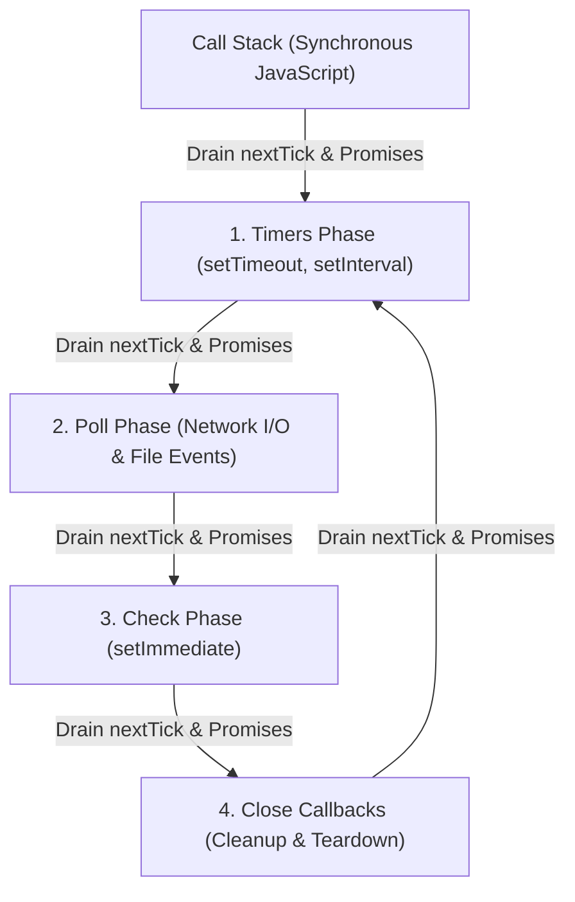

# Day 02: Event Loop and Scheduling

<nav aria-label="Lecture navigation">

[← Previous: Node.js Runtime and Architecture](day-01-node-runtime-and-architecture.md) | [Roadmap](../node-roadmap.md) | [Next: Modules, Packages, and Resolution →](day-03-modules-packages-and-resolution.md)

</nav>

---

## What You Will Learn Today

By the end of this lecture, you should be able to:

- Explain what the libuv event loop is and how it coordinates asynchronous non-blocking I/O on a single JavaScript thread.
- Detail the exact responsibilities, execution order, and exit conditions of all six libuv loop phases.
- Differentiate between the two microtask queues (`process.nextTick` and ECMAScript Promises) and predict when microtask checkpoints drain.
- Explain why the execution order between `setTimeout(fn, 0)` and `setImmediate(fn)` is non-deterministic at the top level but strictly deterministic inside an I/O callback.
- Understand the Node.js 20+ libuv timer refactor and how it affects loop iteration checkpoints.
- Trace the complete lifecycle of an asynchronous operation from JavaScript invocation through OS/thread pool delegation to callback dispatch.
- Identify and prevent event loop starvation caused by synchronous execution blocks and recursive microtask queues.
- Partition CPU-intensive work across event loop iterations using cooperative chunking with `setImmediate()`.
- Measure production event loop lag using the built-in `node:perf_hooks` module.

---

## Prerequisites

Before studying this lecture, you should be comfortable with:
- **Node.js Architecture Basics:** Understanding how V8, Node core bindings, and libuv cooperate ([Day 01: Node.js Runtime and Architecture](day-01-node-runtime-and-architecture.md)).
- **JavaScript Microtasks and Jobs:** Understanding the call stack, Promise jobs, and task scheduling ([JavaScript Day 20: Jobs, Microtasks, and Scheduling](../../Javascript/javascript-lectures/day-20-jobs-microtasks-and-scheduling.md)).

*Upcoming Connections:*
- [Day 03: Modules, Packages, and Resolution](day-03-modules-packages-and-resolution.md) explores synchronous module evaluation on the main thread.
- [Day 08: Streams and Backpressure](day-08-streams-and-backpressure.md) demonstrates non-blocking data streaming through the Poll phase.
- [Day 11: Worker Threads and Child Processes](day-11-worker-threads-and-child-processes.md) provides true hardware parallelism for CPU workloads that cannot be safely partitioned.

---

## Quick Vocabulary Card

| Term | Definition |
| :--- | :--- |
| **Event Loop** | A semi-infinite control loop managed by libuv that collects OS events and pushes queued callbacks onto V8's call stack. |
| **Call Stack** | The V8 execution stack where synchronous JavaScript functions and active callbacks run to completion. |
| **Microtask Checkpoint** | A synchronization point occurring whenever the call stack empties, where `nextTick` and Promise queues drain completely. |
| **`process.nextTick` Queue** | A Node.js-internal queue that drains immediately before any Promise jobs or event loop phases. |
| **Promise Microtask Queue** | The ECMAScript standard job queue executing `.then()`, `.catch()`, `.finally()`, and resumed `async/await` continuations. |
| **Timers Phase** | The libuv loop phase that executes callbacks for expired `setTimeout()` and `setInterval()` timers. |
| **Poll Phase** | The core libuv phase that retrieves OS I/O events, executes ready I/O callbacks, and blocks to wait if no work is pending. |
| **Check Phase** | The libuv phase dedicated exclusively to executing callbacks scheduled via `setImmediate()`, running directly after Poll. |
| **Close Callbacks Phase** | The libuv phase that handles resource destruction callbacks, such as `socket.on('close', ...)`. |
| **Event Loop Starvation** | A condition where long synchronous tasks or recursive microtasks block the thread, preventing I/O and timers from running. |
| **Event Loop Lag** | The delay between when an asynchronous callback was scheduled to run and when it actually executes on the main thread. |

---

## 1. What is the Event Loop?

The **event loop** is a continuous loop provided by libuv that monitors asynchronous tasks and moves their completed callbacks onto JavaScript's call stack when the stack is empty.

JavaScript executes on a single main thread using a **Run-to-Completion** model: once a function starts executing on V8's call stack, it runs until it finishes without interruption. JavaScript itself has no native concept of network sockets, timers, or disk files. Libuv wraps around V8, delegating external operations to the operating system kernel or background threads, and dispatching callbacks back to JavaScript as events complete.

### Single-Threaded JavaScript vs. Multi-Threaded Node.js

While your JavaScript application code executes on a single main thread, Node.js itself runs multiple threads under the hood:
- **Main JavaScript Thread:** Runs synchronous code, evaluates microtasks, and executes active callbacks.
- **Operating System Kernel:** Handles non-blocking network I/O (TCP/UDP sockets, incoming HTTP requests) asynchronously via OS notification primitives (`epoll`, `kqueue`, `IOCP`).
- **libuv Thread Pool:** Maintains background worker threads (default 4) for blocking system tasks like file I/O, DNS resolution, and native cryptography.

### Real-World Analogy: The Clinic and the Dispatch Clerk

Imagine a medical clinic staffed by a single doctor (**V8 Call Stack**) and an organized dispatch clerk (**libuv Event Loop**):
- The doctor can examine only one patient at a time and never stops midway through an exam (**Run-to-Completion**).
- When a patient requires an X-ray (**Asynchronous I/O**), the doctor sends them to an external radiology lab (**OS Kernel / libuv Thread Pool**) and immediately examines the next waiting patient.
- When the X-ray results return, the clerk files them into specialized colored inboxes (**Loop Phases**).
- Between each patient, the doctor always checks for urgent sticky notes left on the desk (**Microtasks: `nextTick` and Promises**).
- Only when all urgent sticky notes are resolved does the clerk guide the doctor to the next scheduled colored inbox in order.



> **Key Rule:** Microtasks (`process.nextTick` and Promises) are **not** an event loop phase. Instead, Node runs a **Microtask Checkpoint** to drain all pending microtasks immediately after synchronous execution ends, between every single loop phase, and after every individual callback.

```js
// Node.js code
// Demonstrating Run-to-Completion, Phase Dispatch, and Non-blocking Execution

console.log("1. Synchronous main thread start");

// Phase 1: Scheduled in Timers Phase
setTimeout(() => {
  console.log("4. Timer callback executed (Timers Phase)");

  // Microtasks queued inside a callback drain immediately before the next phase!
  process.nextTick(() => console.log("   -> nextTick inside Timer (drains immediately)"));
  Promise.resolve().then(() => console.log("   -> Promise inside Timer (drains immediately)"));
}, 0);

// Phase 5: Scheduled in Check Phase
setImmediate(() => {
  console.log("5. Immediate callback executed (Check Phase)");
});

// Microtask 1: Top-level nextTick queue
process.nextTick(() => {
  console.log("2. Top-level nextTick microtask (runs before any loop phase)");
});

// Microtask 2: Top-level Promise queue
Promise.resolve().then(() => {
  console.log("3. Top-level Promise microtask (runs after nextTick queue)");
});

// ❌ Anti-pattern: Synchronous blocking freezes the call stack and stalls the loop
// const deadline = Date.now() + 2000;
// while (Date.now() < deadline) {} // Freezes all timers, I/O, and microtasks for 2s!

// ✅ Valid: Synchronous code finishes cleanly, leaving the stack empty for the event loop
console.log("6. Synchronous main thread end");

// Expected Output:
// 1. Synchronous main thread start
// 6. Synchronous main thread end
// 2. Top-level nextTick microtask (runs before any loop phase)
// 3. Top-level Promise microtask (runs after nextTick queue)
// 4. Timer callback executed (Timers Phase)
//    -> nextTick inside Timer (drains immediately)
//    -> Promise inside Timer (drains immediately)
// 5. Immediate callback executed (Check Phase)
```

---

## 2. The Six Phases of the libuv Event Loop

An **event loop phase** is a dedicated step in libuv's cycle that manages a specific FIFO queue of callbacks.

When libuv runs an iteration of the event loop, it moves through six distinct phases in rigid sequential order. Each phase processes its queued callbacks until its queue is empty or a system-defined maximum limit is reached.

```text
   ┌───────────────────────┐
┌─>│        Timers         │ (setTimeout, setInterval)
│  └──────────┬────────────┘
│  ┌──────────┴────────────┐
│  │   Pending Callbacks   │ (Deferred OS-level errors)
│  └──────────┬────────────┘
│  ┌──────────┴────────────┐
│  │     Idle, Prepare     │ (libuv internal bookkeeping)
│  └──────────┬────────────┘
│  ┌──────────┴────────────┐
│  │         Poll          │ (Fetch I/O events, block for incoming data)
│  └──────────┬────────────┘
│  ┌──────────┴────────────┐
│  │         Check         │ (setImmediate callbacks)
│  └──────────┬────────────┘
│  ┌──────────┴────────────┐
└──┤    Close Callbacks    │ (socket.on('close'), handle cleanup)
   └───────────────────────┘
```

### 2.1 Timers Phase
The **Timers phase** runs callbacks scheduled by `setTimeout()` and `setInterval()` whose delay threshold has passed.
- **Threshold check:** Timers specify a *minimum elapsed delay*, not a guaranteed execution time. Libuv compares current loop time against a binary min-heap of active timers.
- **The 1ms Delay Clamp:** Passing `0`, negative values, or non-numbers (`setTimeout(fn, 0)`) is automatically clamped by Node.js to `1ms` (`setTimeout(fn, 1)`).

### 2.2 Pending Callbacks Phase
The **Pending Callbacks phase** runs deferred system callbacks carried over from the previous loop iteration.
- **System-level errors:** If an OS operation reports an error (e.g., a TCP socket receives an `ECONNREFUSED` error during connection), certain operating systems defer the error notification. Those callbacks execute here rather than in Poll.

### 2.3 Idle & Prepare Phase
The **Idle and Prepare phase** runs internal libuv bookkeeping routines before polling for new I/O events.
- **Internal only:** Application JavaScript code cannot queue callbacks into this phase; it is used solely by libuv to calibrate internal state.

### 2.4 Poll Phase
The **Poll phase** queries the operating system for new network and file events, runs ready I/O callbacks, and calculates how long to sleep if no work is pending.
- **OS & libuv Boundary:** HTTP and TCP operations do not execute inside the event loop itself. The OS kernel monitors sockets using non-blocking primitives (`epoll` on Linux, `kqueue` on macOS, `IOCP` on Windows). When network packets arrive, the OS wakes libuv, which enters the Poll phase to dispatch the JavaScript callback.
- **Decision Logic upon entering Poll:**
  1. If ready I/O callbacks are queued, Poll executes them sequentially up to a system-defined ceiling.
  2. If the Poll queue is empty:
     - If callbacks are waiting in the **Check Phase** (`setImmediate`), Poll exits immediately and advances to Check.
     - If timers are expired in the **Timers Phase**, Poll exits immediately and wraps around to Timers.
     - If neither condition is met, **libuv blocks the thread and sleeps**, waiting for OS kernel events until an I/O event arrives or the closest timer deadline expires.

```text
               +--------------------------------------+
               |          Enter Poll Phase            |
               +--------------------------------------+
                                  |
                                  v
                   /------------------------------\
                  <  Are I/O callbacks queued?     >
                   \------------------------------/
                             /          \
                     Yes    /            \   No
                           v              v
            +---------------------+   /------------------------------\
            | Run I/O callbacks   |  <   Is setImmediate queued?      >
            | (up to system limit)|   \------------------------------/
            +---------------------+          /              \
                                     Yes    /                \   No
                                           v                  v
                             +--------------------+   /------------------------------\
                             | Leave Poll; go to  |  <   Are expired timers waiting?  >
                             | Check phase        |   \------------------------------/
                             +--------------------+          /              \
                                                     Yes    /                \   No
                                                           v                  v
                                             +--------------------+   +--------------------+
                                             | Leave Poll; wrap   |   | Sleep & block OS   |
                                             | around to Timers   |   | until I/O or timer |
                                             +--------------------+   +--------------------+
```

### 2.5 Check Phase
The **Check phase** runs callbacks registered specifically with `setImmediate()`.
- **Post-Poll Transition:** Designed specifically to execute code *immediately after the Poll phase completes*. If Poll finishes handling an I/O event and a `setImmediate` callback exists, Node transitions directly to Check without waiting for any timer expiration.

### 2.6 Close Callbacks Phase
The **Close Callbacks phase** runs cleanup and destruction callbacks when handles or sockets close abruptly.
- **Resource deallocation:** When an active handle is destroyed via `socket.destroy()`, the `'close'` event callback (`socket.on('close', fn)`) runs here, cleanly isolating teardown logic from operational I/O.

### Summary Comparison Table of Event Loop Phases

| Phase | Handled Operations | Primary APIs | When Does It Exit? |
| :--- | :--- | :--- | :--- |
| **1. Timers** | Expired timer thresholds | `setTimeout()`, `setInterval()` | When all expired timers have run or max threshold reached |
| **2. Pending** | Deferred OS-level system errors | Internal TCP/UDP error handlers | When pending error queue drains |
| **3. Idle/Prepare** | libuv internal sync | None (internal only) | Immediately after internal update completes |
| **4. Poll** | Incoming connections, data, disk I/O | `net.Server`, `fs.readFile`, incoming HTTP | When queue is empty or if `setImmediate`/timers are waiting |
| **5. Check** | Post-I/O callbacks | `setImmediate()` | When all immediate callbacks have executed |
| **6. Close** | Resource destruction & cleanup | `socket.on('close')`, `stream.on('close')` | When all close listeners finish |

```js
// Node.js code
// Demonstrating libuv phase execution and cleanup order

const net = require("node:net");
const fs = require("node:fs");

// 1. Schedule Timers phase
setTimeout(() => {
  console.log("Phase 1: Timers callback executed");
}, 0);

// 2. Schedule Check phase
setImmediate(() => {
  console.log("Phase 5: Check callback executed (setImmediate)");
});

// 3. Schedule Poll & Close phases via TCP socket lifecycle
const server = net.createServer((socket) => {
  // Phase 4: Poll Phase receives incoming socket connection
  console.log("Phase 4: Poll callback executed (incoming connection)");

  socket.on("close", () => {
    // Phase 6: Close Callbacks Phase runs resource teardown
    console.log("Phase 6: Close callback executed (socket closed)");
    server.close();
  });

  // ❌ Anti-pattern: Expecting socket 'close' event to run synchronously on destroy()
  socket.destroy();
  console.log("Synchronous code right after socket.destroy() (runs BEFORE Close phase!)");
});

server.listen(0, () => {
  const client = net.connect(server.address().port);
});

// ✅ Valid: Synchronous setup completes first
console.log("Synchronous setup finished");
```

---

## 3. Microtask Queues: `process.nextTick` vs. Promise Microtasks

A **microtask** is a high-priority JavaScript task that executes immediately after the current call stack clears, before libuv proceeds to the next callback or phase.

A **microtask checkpoint** is the moment when Node pauses loop progression to completely drain all waiting microtasks. Microtasks are managed directly by V8 and Node.js, not by libuv.

### 3.1 Two Separate Microtask Queues
1. **The `process.nextTick` Queue:** A Node.js-specific queue that executes ahead of all other microtasks.
2. **The Promise Microtask Queue:** The ECMAScript standard job queue populated by native Promise reactions (`.then()`, `.catch()`, `.finally()`, and `await` continuations) and `queueMicrotask()`.

### 3.2 Strict Draining Order
Whenever V8 finishes executing a JavaScript callback and the call stack unwinds to zero, Node initiates a microtask checkpoint:
1. Node drains the **entire** `process.nextTick` queue until it is completely empty.
2. Node drains the **entire** Promise microtask queue until it is completely empty.
3. If a `nextTick` callback schedules *another* `nextTick`, the new callback is inserted into the current queue and drained immediately before any Promise or event loop phase can execute.

### 3.3 Modern Checkpoint Frequency (Node.js 11+)
In legacy Node.js (v10 and earlier), microtasks were only drained between phase transitions. Since **Node.js 11+**, Node aligns with the HTML5 web standard: **microtasks drain immediately after every single callback execution**, even between two consecutive timers or two consecutive immediates.

### Summary Comparison: `process.nextTick` vs. Promise Microtasks

| Feature | `process.nextTick()` | `Promise` / `queueMicrotask()` |
| :--- | :--- | :--- |
| **Specification** | Node.js host-specific API | ECMAScript standard specification |
| **Queue Priority** | **Highest** (drains first at every checkpoint) | **High** (drains after `nextTick` empties) |
| **Starvation Risk** | High (recursive calls starve Promises & I/O) | High (recursive chains starve event loop phases) |
| **Primary Use Case** | Error propagation before I/O, clean API callbacks | Standard asynchronous control flow and async/await |

```js
// Node.js code
// Demonstrating microtask checkpoint order and starvation prevention

console.log("1. Script start");

setTimeout(() => {
  console.log("4. Timer 1 executed");

  // Scheduled inside Timer 1 - drains BEFORE Timer 2 can execute!
  process.nextTick(() => console.log("   -> nextTick inside Timer 1"));
}, 0);

setTimeout(() => {
  console.log("5. Timer 2 executed");
}, 0);

// Top-level microtasks
Promise.resolve().then(() => console.log("3. Top-level Promise microtask"));
process.nextTick(() => console.log("2. Top-level nextTick microtask"));

// ❌ Anti-pattern: Recursive nextTick starves Promises and event loop indefinitely
// function starve() {
//   process.nextTick(starve); // Promise and Timers will NEVER run!
// }
// starve();

// ✅ Valid: Clean deferral allows microtask queue to drain and loop to advance
console.log("Script end");

// Expected Output:
// 1. Script start
// Script end
// 2. Top-level nextTick microtask
// 3. Top-level Promise microtask
// 4. Timer 1 executed
//    -> nextTick inside Timer 1
// 5. Timer 2 executed
```

---

## 4. `setTimeout(fn, 0)` vs. `setImmediate(fn)`

`setTimeout(fn, 0)` requests execution in the Timers phase after a minimum 1ms delay, while `setImmediate(fn)` requests execution in the Check phase immediately after the current Poll phase.

The execution order of `setTimeout(fn, 0)` and `setImmediate(fn)` depends entirely on **where** the scheduling calls are made.

### 4.1 Scenario A: Top-Level Execution (Non-Deterministic)
When scheduled from the main script at the top level, **their relative execution order is non-deterministic (cannot be guaranteed)**.

Why:
1. When Node compiles and executes the top-level script, it registers a timer with a 0ms delay. Internally, Node clamps `0` to `1ms`.
2. Node registers an immediate callback in the Check phase.
3. Node enters the libuv event loop. Initializing the loop requires a variable amount of CPU time (process bootstrap, V8 AST compilation, OS clock resolution).
4. If the loop enters the Timers phase before 1ms of wall-clock time has passed, the timer has not expired. The loop skips Timers, passes through Poll, and executes `setImmediate` in the Check phase first.
5. If the system experiences CPU load or the clock ticks past 1ms before the loop starts, the timer is seen as expired, and `setTimeout` runs first.

```js
// Node.js code
// Demonstrating Scenario A: Top-level non-deterministic execution

// Register timer (Timers phase) and immediate (Check phase) at top level
setTimeout(() => {
  console.log("Timer callback: setTimeout(fn, 0)");
}, 0);

setImmediate(() => {
  console.log("Immediate callback: setImmediate(fn)");
});

// ❌ Trap: Assuming setTimeout(fn, 0) always runs before setImmediate(fn)
// - If the event loop starts in < 1ms: setImmediate runs FIRST (timer has not expired yet).
// - If process startup or clock jitter exceeds 1ms: setTimeout runs FIRST.
// ✅ Rule: Never write production logic that relies on top-level ordering between these two!

// Possible Outcome 1 (Fast loop startup / high CPU speed):
// Immediate callback: setImmediate(fn)
// Timer callback: setTimeout(fn, 0)

// Possible Outcome 2 (Clock resolution jitter / slight startup delay):
// Timer callback: setTimeout(fn, 0)
// Immediate callback: setImmediate(fn)
```

### 4.2 Scenario B: Inside an I/O Callback (Strictly Deterministic)
Inside any I/O callback, **`setImmediate()` is 100% GUARANTEED to execute before `setTimeout(fn, 0)`.**

Why:
1. An active I/O callback executes inside the **Poll Phase**.
2. Inside that callback, you schedule both `setImmediate()` and `setTimeout(fn, 0)`.
3. When the I/O callback completes, the event loop must advance.
4. The **Check Phase immediately follows the Poll Phase**, whereas the Timers Phase can only be reached on the *subsequent* iteration of the loop.
5. Therefore, `setImmediate()` always runs first in any I/O cycle.

```js
// Node.js code
// Demonstrating Scenario B: Strictly deterministic ordering inside an I/O cycle

const fs = require("node:fs");

fs.readFile(__filename, () => {
  console.log("--- Inside I/O Cycle (Poll Phase) ---");

  // Both scheduled inside Poll Phase:
  setTimeout(() => {
    console.log("2. Timer: setTimeout(fn, 0) [Runs on NEXT loop cycle]");
  }, 0);

  setImmediate(() => {
    console.log("1. Immediate: setImmediate(fn) [Runs in CURRENT Check phase]");
  });

  // ✅ Guaranteed Order: setImmediate ALWAYS executes before setTimeout(0) here.
  // ❌ Anti-pattern: Believing setTimeout(0) can bypass Check and wrap around to Timers early.
});

// Guaranteed Output:
// --- Inside I/O Cycle (Poll Phase) ---
// 1. Immediate: setImmediate(fn) [Runs in CURRENT Check phase]
// 2. Timer: setTimeout(fn, 0) [Runs on NEXT loop cycle]
```

### 4.3 Node.js 20+ Libuv Timer Refactor
In Node.js 20, libuv refactored how timer deadlines are evaluated relative to the poll timeout. Timers are processed after the Poll phase during the loop iteration rather than both before and after poll. While this improved internal timer consistency and reduced unnecessary syscalls, top-level non-determinism remains unchanged due to initial process startup clock jitter.

### Summary Comparison: `setTimeout(fn, 0)` vs. `setImmediate(fn)`

| Feature | `setTimeout(fn, 0)` | `setImmediate(fn)` |
| :--- | :--- | :--- |
| **libuv Phase** | Timers Phase | Check Phase |
| **Delay Clamp** | Clamped to minimum `1ms` | No delay; executes immediately after Poll |
| **Top-Level Order** | Non-deterministic (depends on clock jitter) | Non-deterministic (depends on clock jitter) |
| **Inside I/O Order** | Runs on the **subsequent** loop cycle | **Guaranteed to run first** in current cycle |
| **Primary Use Case** | Delays, timeouts, periodic retries | Cooperative CPU chunking, yielding after I/O |

---

## 5. Lifecycle of an Asynchronous Operation

An **asynchronous operation lifecycle** is the step-by-step path a non-blocking request follows from JavaScript dispatch through the OS kernel or libuv thread pool back to the call stack.

```text
[1. JS Invocation]      fs.readFile('data.txt', callback)
                              │
[2. Node Core Binding]  Validates arguments; translates JS callback to native C++ handle
                              │
[3. Libuv Delegation]   Submits filesystem request to libuv Thread Pool
                              │
[4. Main Thread Frees]  Call stack unwinds; JavaScript continues running synchronously
                              │
                        [...Time passes: libuv background thread reads disk...]
                              │
[5. I/O Completion]     Thread finishes; notifies libuv main loop via OS pipe
                              │
[6. Poll Phase]         Event loop wakes; Poll phase retrieves completion packet
                              │
[7. JS Callback Push]   libuv pushes callback to V8 Call Stack
                              │
[8. Microtask Drain]    Callback finishes; nextTick & Promise queues drain immediately
```

### Complete Event-Loop Trace: A Comprehensive Walkthrough

Follow this complete execution trace carefully. Every step illustrates how synchronous execution, microtask checkpoints, and event loop phases interleave:

```js
// Node.js code
// Comprehensive Scheduling Trace

const fs = require("node:fs");

console.log("A: Synchronous start");

setTimeout(() => {
  console.log("D: Top-level timer callback (Timers Phase)");
}, 0);

setImmediate(() => {
  console.log("E: Top-level immediate callback (Check Phase)");
});

fs.readFile(__filename, () => {
  console.log("F: I/O callback executed (Poll Phase)");
  process.nextTick(() => console.log("G: nextTick from I/O"));
  Promise.resolve().then(() => console.log("H: Promise from I/O"));
  setImmediate(() => console.log("I: setImmediate from I/O"));
  setTimeout(() => console.log("J: setTimeout(0) from I/O"), 0);
});

Promise.resolve().then(() => console.log("C: Top-level promise"));
process.nextTick(() => console.log("B: Top-level nextTick"));

// ❌ Mistake: Believing fs.readFile callback runs before synchronous script completes
console.log("K: Synchronous end");

// Expected Output:
// A: Synchronous start
// K: Synchronous end
// B: Top-level nextTick
// C: Top-level promise
// (D: Top-level timer callback OR E: Top-level immediate callback)
// (E: Top-level immediate callback OR D: Top-level timer callback)
// F: I/O callback executed (Poll Phase)
// G: nextTick from I/O
// H: Promise from I/O
// I: setImmediate from I/O
// J: setTimeout(0) from I/O
```

### Trace Step-by-Step Breakdown:
1. **Synchronous Execution:**
   - Logs `A: Synchronous start`.
   - `setTimeout` registers in Timers min-heap.
   - `setImmediate` registers in Check queue.
   - `fs.readFile` dispatches file request to the libuv thread pool.
   - `Promise.resolve().then` queues into Promise microtask queue.
   - `process.nextTick` queues into `nextTick` microtask queue.
   - Logs `K: Synchronous end`.
2. **Initial Microtask Checkpoint:**
   - Call stack is empty. `nextTick` queue drains: Logs `B: Top-level nextTick`.
   - Promise queue drains: Logs `C: Top-level promise`.
3. **Event Loop Begins:**
   - Executes `D` and `E` (order between `D` and `E` may flip depending on startup clock jitter).
4. **Poll Phase (I/O Ready):**
   - The thread pool completes reading the file. Poll phase retrieves the event and executes `F: I/O callback executed`.
5. **Microtask Checkpoint Inside I/O:**
   - Immediately after `F` finishes, microtasks drain before advancing:
   - Logs `G: nextTick from I/O`.
   - Logs `H: Promise from I/O`.
6. **Check Phase Follows Poll:**
   - Loop leaves Poll and transitions directly to Check phase:
   - Logs `I: setImmediate from I/O`.
7. **Next Loop Iteration (Timers):**
   - Loop completes cycle and enters Timers phase on the subsequent iteration:
   - Logs `J: setTimeout(0) from I/O`.

---

## 6. Event Loop Starvation and Work Partitioning

**Event loop starvation** occurs when synchronous JavaScript code or endless microtasks monopolize the call stack, preventing libuv from processing I/O, timers, or network traffic.

Because Node.js executes JavaScript on a single thread, long computations block all incoming network requests, health checks, and timer deadlines.

### 6.1 Starvation via Recursive `process.nextTick`
Because Node drains the `nextTick` queue recursively before any event loop phase or Promise job, an unchecked `nextTick` recursion completely freezes the server.

### 6.2 Work Partitioning with `setImmediate`
When you have a computationally heavy operation (such as parsing a 50,000-element array) that cannot be immediately offloaded to a Worker Thread, you must **partition** the work cooperatively across multiple event loop turns using `setImmediate()`.

By yielding back to the Check phase after processing a bounded batch, you allow the Poll phase to handle incoming HTTP requests and let timers fire between chunks.

```js
// Node.js code
// Demonstrating Event Loop Starvation vs. Cooperative Work Partitioning

// Register a canary timer to measure responsiveness
setTimeout(() => {
  console.log("✅ Canary Timer fired (Event loop is healthy!)");
}, 20);

// ❌ Anti-pattern: Starvation via recursive nextTick (freezes the loop)
function triggerStarvation() {
  let count = 0;
  function starve() {
    count++;
    if (count < 1000000) {
      // Re-queues into nextTick before loop can EVER advance!
      process.nextTick(starve);
    }
  }
  starve();
}
// triggerStarvation(); // Uncommenting this delays the canary timer by hundreds of ms!

// ✅ Solution: Cooperative Partitioning using setImmediate
function processLargeDatasetCooperatively(items, batchSize, onProgress, onComplete) {
  let currentIndex = 0;

  function processNextBatch() {
    const end = Math.min(currentIndex + batchSize, items.length);

    // Process a small, bounded slice synchronously
    while (currentIndex < end) {
      const item = items[currentIndex];
      item.processed = true;
      currentIndex++;
    }

    onProgress(currentIndex, items.length);

    if (currentIndex < items.length) {
      // ✅ Yield control back to libuv!
      // Allows incoming HTTP requests, I/O, and timers to run before the next chunk.
      setImmediate(processNextBatch);
    } else {
      onComplete();
    }
  }

  // Kick off the first batch
  setImmediate(processNextBatch);
}

// Usage:
const dataset = Array.from({ length: 5000 }, (_, i) => ({ id: i }));

processLargeDatasetCooperatively(
  dataset,
  1000, // 1,000 items per batch
  (done, total) => console.log(`Batch progress: ${done}/${total}`),
  () => console.log("✅ All items processed cooperatively without stalling I/O!")
);
```

---

## 7. Monitoring Event Loop Delay in Production

**Event loop delay** (or lag) is the difference in time between when an asynchronous callback was scheduled to execute and when it actually began running on the main thread.

In production microservices, high CPU utilization does not always mean high response latency—and low CPU utilization can hide massive event loop stalls if the thread is frequently blocked by 50ms synchronous freezes.

### Measuring Lag with `node:perf_hooks`
Node.js provides a native, low-overhead histogram utility in the `node:perf_hooks` module called `monitorEventLoopDelay`. It measures loop delay in nanoseconds with negligible CPU impact.

```js
// Node.js code
// Production Event Loop Lag Monitoring via node:perf_hooks

const { monitorEventLoopDelay } = require("node:perf_hooks");

// Initialize the delay monitor with a 20ms sampling resolution
const histogram = monitorEventLoopDelay({ resolution: 20 });

// Enable monitoring
histogram.enable();

// Periodically inspect metrics (e.g., every 2 seconds for Prometheus/APM)
const intervalId = setInterval(() => {
  // Convert nanoseconds to milliseconds
  const minMs = (histogram.min / 1e6).toFixed(2);
  const maxMs = (histogram.max / 1e6).toFixed(2);
  const meanMs = (histogram.mean / 1e6).toFixed(2);
  const p99Ms = (histogram.percentile(99) / 1e6).toFixed(2);

  console.log(`[Event Loop Lag] Min: ${minMs}ms | Mean: ${meanMs}ms | p99: ${p99Ms}ms | Max: ${maxMs}ms`);

  // Reset the histogram for the next interval window
  histogram.reset();
}, 2000);

// ❌ Anti-pattern simulation: Synchronous blocking spikes lag
setTimeout(() => {
  console.log("Simulating 120ms synchronous CPU freeze...");
  const blockUntil = Date.now() + 120;
  while (Date.now() < blockUntil) {} // Stalls the thread
}, 1000);

// Cleanup after 5 seconds
setTimeout(() => {
  clearInterval(intervalId);
  histogram.disable();
  console.log("Monitoring stopped.");
}, 5000);
```

---

## 8. JavaScript, Node.js, and DSA Connections

Understanding event loop mechanics requires connecting language semantics, runtime architecture, and data structures.

- **JavaScript Language Connection:** ECMAScript specifies the Call Stack, Execution Contexts, and Job Queues (Promises). The language specification has no concept of files, network sockets, or timers. It only requires that pending jobs drain whenever the call stack unwinds to zero.
- **Node.js Platform Connection:** Node.js implements the host platform. Libuv supplies the 6-phase scheduling loop that bridges OS notification primitives (`epoll`, `kqueue`, `IOCP`) and background thread pools to V8 callbacks.
- **DSA Connection:**
  - **Min-Heap for Timers:** Libuv manages active timers in a binary min-heap where the root is always the timer with the nearest expiration deadline ($O(1)$ peek, $O(\log n)$ insertion and deletion).
  - **FIFO Queues:** Microtasks, Check (`setImmediate`), and Close callbacks are organized as linked FIFO queues ($O(1)$ enqueue and dequeue).
  - **Queue Starvation & Latency:** If tasks are enqueued faster than the single thread can process them ($R_{\text{in}} > R_{\text{out}}$), queue depth grows linearly, consuming heap memory and starving downstream event loop phases.

---

## Tricky Points

### 1. `setTimeout(fn, 0)` is Never 0 Milliseconds
Node.js clamps delay values `0`, negative numbers, and non-numbers (`NaN`) to `1`. Even after 1ms elapses, the callback cannot run until the current call stack finishes, all microtasks drain, and the loop reaches the Timers phase.

### 2. `await` Does NOT Make Synchronous Code Asynchronous
Marking a function `async` does not run its body on a background thread. Everything up to the first `await` keyword runs **100% synchronously**. Any synchronous computation passed inside `await Promise.resolve(heavySyncTask())` executes synchronously *before* the promise is resolved.

### 3. `EventEmitter.emit()` is Completely Synchronous
Many developers mistakenly believe that events run on the event loop. In reality, `emitter.emit('event')` invokes all registered listeners synchronously one after another on the current call stack.

```js
// Node.js code
// Demonstrating EventEmitter synchronous execution trap

const EventEmitter = require("node:events");
const emitter = new EventEmitter();

emitter.on("userCreated", () => {
  console.log("2. Listener 1 (runs synchronously on current stack)");
});

emitter.on("userCreated", () => {
  console.log("3. Listener 2 (runs synchronously on current stack)");
});

console.log("1. Before emit");

// ❌ Trap: Assuming emit() schedules listeners on the event loop
emitter.emit("userCreated");

console.log("4. After emit");

// ✅ Valid: Wrap in setImmediate if you need asynchronous event dispatching
emitter.on("asyncUserCreated", () => {
  setImmediate(() => {
    console.log("5. Async Listener (dispatched via Check phase)");
  });
});
emitter.emit("asyncUserCreated");

// Expected Output:
// 1. Before emit
// 2. Listener 1 (runs synchronously on current stack)
// 3. Listener 2 (runs synchronously on current stack)
// 4. After emit
// 5. Async Listener (dispatched via Check phase)
```

### 4. Overfilling the libuv Thread Pool
Operations like `fs.readFile()`, `crypto.pbkdf2()`, and `dns.lookup()` run on the libuv thread pool, not on the main thread. By default, `UV_THREADPOOL_SIZE` is **4**. If 5 simultaneous `crypto.pbkdf2()` calls run, the 5th must wait until one of the first 4 finishes, introducing unexpected latency even though the main JavaScript thread is idle.

### 5. `queueMicrotask()` vs. `process.nextTick()` Priority
`queueMicrotask()` places tasks into the standard ECMAScript Promise microtask queue. `process.nextTick()` places tasks into the Node-specific nextTick queue. Node always drains the entire `nextTick` queue before executing a single task from `queueMicrotask()`.

```js
// Node.js code
// Demonstrating queueMicrotask vs process.nextTick priority

queueMicrotask(() => {
  console.log("2. queueMicrotask executed (Promise job queue)");
});

process.nextTick(() => {
  console.log("1. process.nextTick executed (nextTick queue drains first)");
});

// Expected Output:
// 1. process.nextTick executed (nextTick queue drains first)
// 2. queueMicrotask executed (Promise job queue)
```

---

## Hands-On Exercise

### Scenario: Fixing Health Check Failures During Batch Processing
Your team runs an Express API that exports large CSV reports. Whenever a user requests an export of 50,000 records, the API freezes the single JavaScript thread for ~1.5 seconds. During this window, Kubernetes `/healthz` probes time out, causing the orchestrator to kill and restart the container.

### Buggy Code
```js
// Node.js code
// BUGGY: Synchronous computation freezes the entire server

const http = require("node:http");

function generateLargeReportSync() {
  const records = [];
  // Simulating 50,000 intensive records
  for (let i = 0; i < 50000; i++) {
    let hash = 0;
    for (let j = 0; j < 1000; j++) {
      hash = (hash + (i * j)) % 1000000;
    }
    records.push({ id: i, hash });
  }
  return records;
}

const server = http.createServer((req, res) => {
  if (req.url === "/healthz") {
    // Should respond immediately with 200 OK
    res.writeHead(200, { "Content-Type": "text/plain" });
    res.end("OK");
  } else if (req.url === "/export") {
    // ❌ Freezes the event loop for ~1.5 seconds!
    const data = generateLargeReportSync();
    res.writeHead(200, { "Content-Type": "application/json" });
    res.end(JSON.stringify({ count: data.length }));
  }
});

server.listen(3000);
```

### Acceptance Criteria
1. The `/export` endpoint must process all 50,000 items accurately.
2. The heavy computation must be partitioned into cooperative batches using `setImmediate()`.
3. While the export is computing, concurrent calls to `/healthz` must respond within **< 10ms**.
4. The function must handle client disconnections gracefully (`req.destroyed`) and abort remaining batches if the request is canceled.

### Solution Code
```js
// Node.js code
// SOLUTION: Cooperative chunking with client cancellation support

const http = require("node:http");

function generateReportChunked(totalItems, chunkSize, req, onComplete, onError) {
  const records = [];
  let currentIndex = 0;

  function processChunk() {
    // Abort processing if client disconnected while computation was yielded
    if (req.destroyed) {
      console.log("Client aborted request; halting chunk processing.");
      return;
    }

    const limit = Math.min(currentIndex + chunkSize, totalItems);

    try {
      while (currentIndex < limit) {
        let hash = 0;
        for (let j = 0; j < 1000; j++) {
          hash = (hash + (currentIndex * j)) % 1000000;
        }
        records.push({ id: currentIndex, hash });
        currentIndex++;
      }

      if (currentIndex < totalItems) {
        // ✅ Yield control back to libuv Check phase
        // Allows /healthz and network I/O to execute before the next slice
        setImmediate(processChunk);
      } else {
        onComplete(records);
      }
    } catch (err) {
      onError(err);
    }
  }

  // Start the first batch
  setImmediate(processChunk);
}

const server = http.createServer((req, res) => {
  if (req.url === "/healthz") {
    // ✅ Responds immediately even during heavy export calculations
    res.writeHead(200, { "Content-Type": "text/plain" });
    res.end("OK");
  } else if (req.url === "/export") {
    generateReportChunked(
      50000,
      2000, // 2,000 items per chunk (~10ms execution slice)
      req,
      (data) => {
        if (!res.writableEnded) {
          res.writeHead(200, { "Content-Type": "application/json" });
          res.end(JSON.stringify({ count: data.length }));
        }
      },
      (err) => {
        if (!res.writableEnded) {
          res.writeHead(500, { "Content-Type": "text/plain" });
          res.end("Internal Server Error: " + err.message);
        }
      }
    );
  }
});

server.listen(3000, () => {
  console.log("Server listening on http://localhost:3000");
});
```

### Solution Explanation

1. **Why the original code failed:** The synchronous `for` loop monopolized V8's call stack for ~1.5 seconds. Because JavaScript is single-threaded, libuv could not enter the **Poll phase** to accept incoming TCP connections or process HTTP requests for `/healthz`, causing Kubernetes health probes to time out and restart the pod.
2. **Cooperative Chunking with `setImmediate()`:** Instead of processing all 50,000 items in one blocking block, `generateReportChunked` processes a bounded batch of 2,000 items (~10ms CPU slice) and yields control back to the event loop via `setImmediate(processChunk)`.
3. **Event Loop Turnaround:** When `setImmediate()` yields, the call stack empties. Libuv advances from Check $\to$ Close $\to$ Timers $\to$ **Poll**, where it immediately handles incoming `/healthz` socket events (< 10ms response time) before executing the next computational batch.
4. **Cancellation Safety:** Checking `req.destroyed` before each chunk prevents "ghost processing." If the client disconnects or aborts the HTTP request mid-way, remaining chunks are discarded immediately, saving server CPU.

### Production Improvements: 3 Advanced Patterns

While the recursive `setImmediate` callback chunking above satisfies the acceptance criteria, production backend applications typically improve upon it using one of three architectural patterns:

#### Pattern 1: Async Generator Chunking with Native `AbortSignal`
An **async generator chunker** processes items in an asynchronous loop, yielding control back to libuv using a promisified `setImmediate` and checking `signal.aborted` natively.
- **Why it improves the code:** It replaces callback nesting with clean, composable `for await...of` loops and standard `req.signal` (`AbortSignal`) cancellation, making batch generation logic reusable across multiple endpoints.

```js
// Node.js code
// Pattern 1: Async Generator with AbortSignal Cancellation

const http = require("node:http");

// Promisified yield to libuv Check phase
const yieldToEventLoop = () => new Promise((resolve) => setImmediate(resolve));

async function* generateRecordsAsync(totalItems, chunkSize, signal) {
  let currentIndex = 0;

  while (currentIndex < totalItems) {
    // Check if client disconnected while waiting on event loop
    if (signal?.aborted) {
      console.log("Client aborted request; halting generator.");
      return;
    }

    const chunk = [];
    const limit = Math.min(currentIndex + chunkSize, totalItems);

    while (currentIndex < limit) {
      chunk.push({ id: currentIndex, hash: (currentIndex * 31) % 1000000 });
      currentIndex++;
    }

    yield chunk;

    // ✅ Yield execution to libuv so /healthz and network I/O can execute
    await yieldToEventLoop();
  }
}

// ❌ Anti-pattern: Using a raw while-loop inside async function without yieldToEventLoop() (still blocks!)
// ✅ Valid: Consuming the async generator chunk-by-chunk cleanly
const server = http.createServer(async (req, res) => {
  if (req.url === "/healthz") {
    res.writeHead(200, { "Content-Type": "text/plain" });
    return res.end("OK");
  }

  if (req.url === "/export") {
    const allRecords = [];

    try {
      for await (const chunk of generateRecordsAsync(50000, 2000, req.signal)) {
        allRecords.push(...chunk);
      }

      if (!res.writableEnded) {
        res.writeHead(200, { "Content-Type": "application/json" });
        res.end(JSON.stringify({ count: allRecords.length }));
      }
    } catch (err) {
      if (!res.writableEnded) {
        res.writeHead(500, { "Content-Type": "text/plain" });
        res.end("Internal Server Error: " + err.message);
      }
    }
  }
});
```

#### Pattern 2: Stream-Delimited Response (Eliminates `JSON.stringify` Heap Freeze)
A **streaming response** writes batch chunks directly into the outgoing HTTP socket as newline-delimited JSON (`ndjson`), without buffering the entire dataset in an in-memory array.
- **Why it improves the code:** In the basic solution, running `JSON.stringify(records)` on 50,000 objects causes a secondary synchronous freeze (80–150ms) and consumes large heap memory. Streaming records as they are computed eliminates both the serialization pause and the memory bloat.

```js
// Node.js code
// Pattern 2: Direct Chunked Streaming via Readable.from (Zero Buffer Bloat)

const http = require("node:http");
const { Readable } = require("node:stream");

async function* streamRecordsGenerator(totalItems, signal) {
  for (let i = 0; i < totalItems; i++) {
    if (signal?.aborted) return;

    // Yield control to the event loop every 1,000 records
    if (i > 0 && i % 1000 === 0) {
      await new Promise((resolve) => setImmediate(resolve));
    }

    // Yield an NDJSON line directly to the stream pipeline
    yield JSON.stringify({ id: i, hash: (i * 31) % 1000000 }) + "\n";
  }
}

const server = http.createServer((req, res) => {
  if (req.url === "/healthz") {
    res.writeHead(200, { "Content-Type": "text/plain" });
    return res.end("OK");
  }

  if (req.url === "/export") {
    // ❌ Anti-pattern: Buffering 50,000 objects in RAM and calling JSON.stringify(largeArray)
    // ✅ Valid: Streams NDJSON line-by-line; memory stays bounded (< 20MB)
    res.writeHead(200, { "Content-Type": "application/x-ndjson" });

    const recordStream = Readable.from(streamRecordsGenerator(50000, req.signal));
    recordStream.pipe(res);

    recordStream.on("error", (err) => {
      console.error("Stream error:", err);
      if (!res.headersSent) res.writeHead(500);
      res.end();
    });
  }
});
```

#### Pattern 3: True Parallelism via Worker Threads
A **worker thread offloader** moves CPU-heavy batch calculations completely off the main JavaScript thread into a background OS thread.
- **Why it improves the code:** Cooperative chunking still consumes main thread CPU time overall (it just splits it up). For intensive cryptographic or mathematical batch tasks, offloading to `node:worker_threads` achieves **0ms main event loop delay**, leaving the main thread completely free for HTTP traffic and health checks.

```js
// Node.js code
// Pattern 3: Offloading CPU-Bound Batch Calculation to a Worker Thread

const http = require("node:http");
const { Worker } = require("node:worker_threads");

// In production, point to a dedicated worker.js file
const workerScript = `
  const { parentPort, workerData } = require("node:worker_threads");
  const records = [];
  for (let i = 0; i < workerData.total; i++) {
    let hash = 0;
    for (let j = 0; j < 1000; j++) {
      hash = (hash + (i * j)) % 1000000;
    }
    records.push({ id: i, hash });
  }
  parentPort.postMessage({ count: records.length });
`;

function runWorkerTask(total) {
  return new Promise((resolve, reject) => {
    const worker = new Worker(workerScript, {
      eval: true,
      workerData: { total },
    });

    worker.on("message", resolve);
    worker.on("error", reject);
    worker.on("exit", (code) => {
      if (code !== 0) reject(new Error(\`Worker stopped with code \${code}\`));
    });
  });
}

const server = http.createServer(async (req, res) => {
  if (req.url === "/healthz") {
    // ✅ Main thread event loop is 100% idle; responds immediately (< 1ms)
    res.writeHead(200, { "Content-Type": "text/plain" });
    return res.end("OK");
  }

  if (req.url === "/export") {
    try {
      // ❌ Anti-pattern: Running heavy hashing on main thread even with chunking
      // ✅ Valid: Heavy computation runs in background OS worker thread
      const result = await runWorkerTask(50000);
      res.writeHead(200, { "Content-Type": "application/json" });
      res.end(JSON.stringify(result));
    } catch (err) {
      res.writeHead(500, { "Content-Type": "text/plain" });
      res.end("Worker Error: " + err.message);
    }
  }
});
```

---

## Summary

- The event loop is a single-threaded orchestrator provided by libuv that collects OS I/O notifications and schedules callbacks on V8's call stack.
- The six libuv loop phases execute in strict sequential order: **Timers $\to$ Pending Callbacks $\to$ Idle/Prepare $\to$ Poll $\to$ Check $\to$ Close Callbacks**.
- The **Poll phase** is the central waiting room: it runs ready I/O callbacks, blocks for incoming events, and transitions immediately to Check if `setImmediate()` has been queued.
- **Microtasks** (`process.nextTick` and Promise jobs) run at microtask checkpoints immediately after any callback finishes. `process.nextTick` always drains before Promise jobs.
- `setTimeout(fn, 0)` vs `setImmediate(fn)` execution order is non-deterministic at the top level due to OS clock resolution, but `setImmediate` is **guaranteed** to run first when called inside an I/O callback.
- Event loop starvation occurs when long synchronous tasks or recursive microtasks monopolize the thread. Prevent it using cooperative chunking (`setImmediate()`) or Worker Threads.
- Monitor production loop latency using `perf_hooks.monitorEventLoopDelay()` to catch p99 lag spikes before they trigger client timeouts.

---

## Cheat Sheet

### Event Loop Phases at a Glance

| Phase | Handled Callbacks | Transition Condition |
| :--- | :--- | :--- |
| **Timers** | Expired `setTimeout`, `setInterval` | All ready timers evaluated |
| **Pending** | Deferred system-level OS errors | Queue drained |
| **Idle/Prepare** | Internal libuv housekeeping | Completed immediately |
| **Poll** | Ready network, disk, and pipe I/O | Queue empty, or immediate/timer waiting |
| **Check** | `setImmediate()` callbacks | Check queue drained |
| **Close** | Socket and handle teardown events | Close queue drained |

### Scheduling Tools Comparison

| Mechanism | Target Phase / Queue | Relative Priority | Primary Use Case |
| :--- | :--- | :--- | :--- |
| `process.nextTick()` | `nextTick` Microtask Queue | **Highest** (before promises & phases) | Emergency error propagation, clean API callbacks |
| `queueMicrotask()` / `Promise` | Promise Microtask Queue | **High** (after nextTick, before phases) | Standard ECMAScript async continuations |
| `setImmediate()` | Check Phase (libuv) | **Medium** (immediately after Poll) | Cooperative CPU chunking, yielding after I/O |
| `setTimeout(fn, ms)` | Timers Phase (libuv) | **Lowest** (subject to threshold check) | Scheduled timeouts, delayed retries |

### Common Pitfalls
- **Assuming `setTimeout(fn, 0)` runs in 0ms:** Node clamps `0` to `1ms`, and execution depends on loop phase arrival.
- **Starving the loop with `process.nextTick`:** Chained `nextTick` calls prevent the loop from ever reaching I/O or timers.
- **Believing `async/await` executes in background threads:** Code up to the first `await` is completely synchronous; `await` only yields when awaiting a pending promise.
- **Assuming `EventEmitter` is asynchronous:** `.emit()` invokes all listener functions synchronously on the current stack.
- **Unbounded thread pool queues:** Exhausting `UV_THREADPOOL_SIZE` (default 4) with synchronous crypto or file reads stalls all other thread pool operations.

---

## Interview Questions

### 1. What is the Event Loop, and how does it interleave with microtasks?
**Question:** Explain the architectural role of the libuv event loop in Node.js. How do microtask queues (`process.nextTick` and Promises) interact with the six event loop phases?

**Answer:**
The event loop is a C library abstraction (provided by libuv) that enables Node.js to perform non-blocking I/O operations despite JavaScript executing on a single thread. It continuously polls the operating system for completed I/O events, timers, and external signals, dispatching their associated JavaScript callbacks to V8's call stack.

The event loop operates in six sequential phases: Timers, Pending Callbacks, Idle/Prepare, Poll, Check, and Close Callbacks. 

Microtasks do not belong to libuv; they are managed directly by V8 and Node.js. There are two distinct microtask queues: the `process.nextTick` queue (highest priority) and the ECMAScript Promise microtask queue. In modern Node.js (v11+), a **microtask checkpoint** occurs whenever the V8 call stack unwinds to zero—including immediately after every single callback finishes within any event loop phase. Node first completely drains the `nextTick` queue, then completely drains the Promise microtask queue before returning control to libuv to execute the next callback or advance to the next phase.

---

### 2. Predict the Output: Top-Level vs. I/O Callback Scheduling
**Question:** What will the following code output, and why? What parts of the output are guaranteed, and what parts are non-deterministic?

```js
// Node.js code
const fs = require("node:fs");

setTimeout(() => console.log("A: Timer 0"), 0);
setImmediate(() => console.log("B: Immediate"));

fs.readFile(__filename, () => {
  setTimeout(() => console.log("C: Timer inside I/O"), 0);
  setImmediate(() => console.log("D: Immediate inside I/O"));
  process.nextTick(() => console.log("E: nextTick inside I/O"));
});

process.nextTick(() => console.log("F: Top nextTick"));
```

**Answer:**
**Execution Output:**
```text
F: Top nextTick
(A: Timer 0 OR B: Immediate)
(B: Immediate OR A: Timer 0)
E: nextTick inside I/O
D: Immediate inside I/O
C: Timer inside I/O
```

**Reasoning:**
1. `F: Top nextTick` is **guaranteed** to print first. Synchronous script execution finishes, triggering the initial microtask checkpoint where `process.nextTick` drains before any event loop phase runs.
2. The order between `A: Timer 0` and `B: Immediate` is **non-deterministic**. `setTimeout(fn, 0)` is clamped to 1ms. If the loop enters the Timers phase faster than 1ms (depending on OS clock resolution and process startup overhead), the timer has not expired, so `setImmediate` (Check phase) runs first. If 1ms has elapsed, `setTimeout` runs first.
3. Inside the `fs.readFile` callback (which executes in the **Poll Phase**):
   - When the callback finishes, the microtask checkpoint runs immediately, printing `E: nextTick inside I/O`.
   - Next, the event loop transitions from Poll directly to the **Check Phase**, guaranteeing that `D: Immediate inside I/O` runs next.
   - `C: Timer inside I/O` is queued in the Timers min-heap and must wait until the loop wraps around to the Timers phase on the *next* iteration, guaranteeing that `D` runs before `C`.

---

### 3. Debugging High Event Loop Latency in Production
**Question:** An Express.js payment gateway suffers from periodic p99 latency spikes of over 2 seconds, but CPU utilization never exceeds 30% and memory usage is normal. How would you systematically diagnose and resolve this issue?

**Answer:**
A system with low CPU utilization but high response latency indicates that the single JavaScript thread is being stalled periodically by synchronous blocking code, or asynchronous tasks are waiting on an exhausted downstream queue.

**Systematic Diagnosis Steps:**
1. **Instrument Event Loop Delay:** Use `node:perf_hooks` with `monitorEventLoopDelay({ resolution: 20 })`. If the histogram reveals maximum delay spikes matching the 2-second spikes, the issue is on the main thread (synchronous freezing). If event loop lag is near zero (< 5ms), the delay is external (e.g., slow database query or network downstream).
2. **Profile Main Thread CPU:** Capture an active V8 CPU profile using `node --cpu-prof` or an APM tool (e.g., Clinic.js Flame, Datadog). Look for long execution blocks in third-party libraries—common culprits include synchronous JSON parsing (`JSON.parse` on 10MB payloads), unindexed regex evaluations (ReDoS), or synchronous encryption/compression calls (`fs.readFileSync`, `crypto.pbkdf2Sync`).
3. **Check Libuv Thread Pool Saturation:** If CPU is low and event loop lag is low, but file or crypto operations are slow, the libuv thread pool may be saturated. The default thread pool size is 4 (`UV_THREADPOOL_SIZE=4`). If DNS lookups (`dns.lookup`) or password hashing (`bcrypt`) saturate these 4 threads, subsequent I/O tasks queue up. Test by increasing `UV_THREADPOOL_SIZE=16`.
4. **Inspect Synchronous Event Emitters:** Verify whether internal event listeners (`emitter.emit()`) execute long synchronous loops, which block the caller on the main thread.

---

### 4. Architectural Tradeoff: Cooperative Chunking vs. Worker Threads
**Question:** You need to process a computationally expensive calculation (generating a cryptographic hash tree over 100,000 objects) inside an HTTP API. Compare the architectural tradeoffs of using cooperative chunking via `setImmediate()` versus offloading the calculation to a `Worker Thread`.

**Answer:**
Both strategies prevent the main event loop from freezing, but they have distinct performance and architectural characteristics:

| Feature | Cooperative Chunking (`setImmediate`) | Worker Threads (`node:worker_threads`) |
| :--- | :--- | :--- |
| **Execution Model** | Interleaved concurrency on the **same single thread**. | True hardware **parallelism** on a separate OS thread. |
| **Total Computation Time** | **Longer**. Adding `setImmediate` yields incurs loop overhead and context switches. | **Shorter**. Runs continuously at 100% core capacity without yielding. |
| **Main Thread Impact** | Small latency impact remains; each chunk still occupies the thread for 5–10ms. | Zero impact on main thread event loop latency. |
| **Memory & Serialization** | Zero serialization cost; operates directly on in-memory objects in the same V8 heap. | Requires data cloning via Structured Clone Algorithm or shared memory (`SharedArrayBuffer`). |
| **Complexity & Overhead** | Simple implementation; no thread lifecycle or pooling management. | Requires managing a thread pool (e.g., `piscina`) to avoid high thread startup overhead (~30ms, ~30MB RAM per thread). |

**Decision Rule:**
- Choose **Cooperative Chunking** if the task is only moderately CPU-intensive, access to large in-memory domain objects is required without serialization overhead, and total completion time is not latency-critical.
- Choose **Worker Threads** if the computation takes $> 50\text{ms}$ continuously, involves heavy mathematical hashing or image processing, and hardware CPU cores are available to run the task in true parallel.

---

<nav aria-label="Lecture navigation">

[← Previous: Node.js Runtime and Architecture](day-01-node-runtime-and-architecture.md) | [Roadmap](../node-roadmap.md) | [Next: Modules, Packages, and Resolution →](day-03-modules-packages-and-resolution.md)

</nav>
